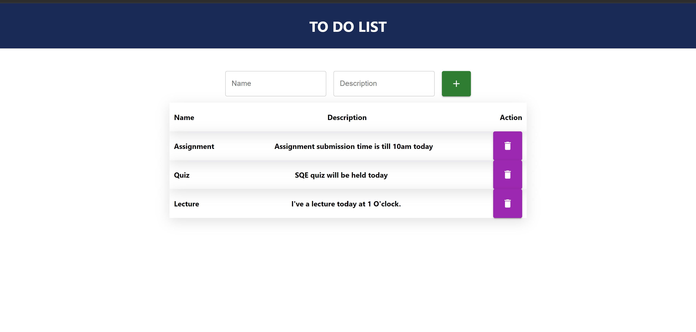

# To Do List

A simple and intuitive to-do list application designed for individuals looking to organize their daily tasks efficiently.

## Description

This To Do List application provides a straightforward way for users to add, edit, and delete tasks. It's designed with simplicity in mind, allowing users to focus on what's important - getting things done. Whether you're planning your day, managing a project, or just keeping track of grocery lists, this app is for you.

## Getting Started

### Dependencies

- Compatible with modern web browsers (Chrome, Firefox, Safari, Edge).
- No specific OS version required.

### Installing

- Clone the repository to your local machine using `git clone https://github.com/MianAliKhalid/todolist`
- Navigate to the project directory and install dependencies with `npm install`.

### Executing program

- Start the application by running `npm start` in the terminal.
- Open your web browser and go to `http://localhost:3000` to view the app.

## Help

If you encounter any issues, please check if there's a similar issue already reported in the issues section of the GitHub repository. If not, feel free to open a new issue.

## Authors

Contributors names and contact info

Current. Mian Ali
Link. [@Mianalikhalid](https://github.com/MianAliKhalid/todolist)

## Version History

- 0.1
    - Initial Release

## License

This project is licensed under the MIT License - see the LICENSE.md file for details

## ScreenShot

